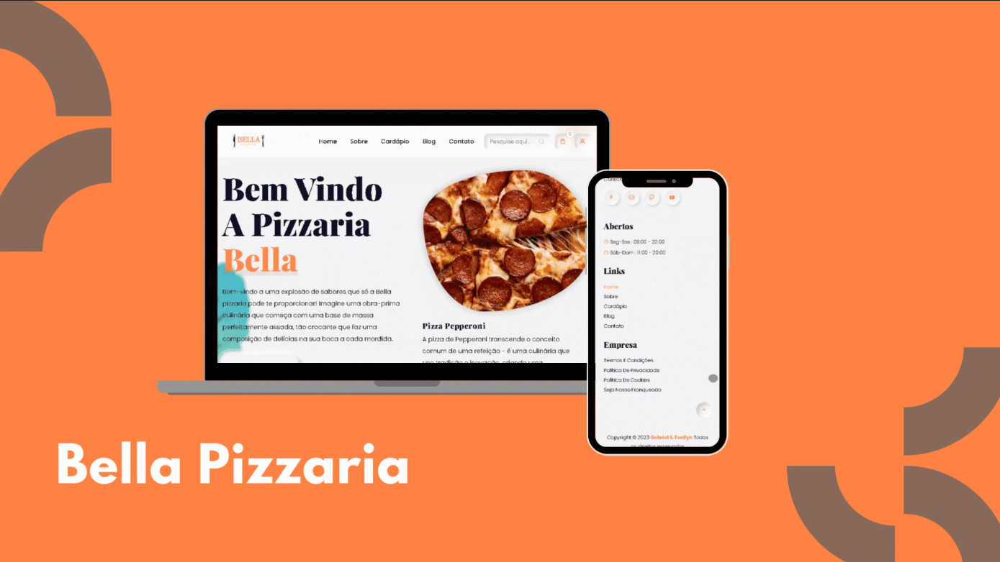

# 🍕 BELLA Pizzaria

<p align="center">
  
</p>

<p align="center">
  <strong>Uma experiência completa de pedidos de pizza online.</strong><br>
  Desenvolvido com HTML, CSS e JavaScript.
</p>

---

## 🌟 Visão Geral

A **BELLA Pizzaria** é um projeto Front-end que simula um sistema de pedidos online para uma pizzaria. O objetivo foi criar uma interface moderna, responsiva e intuitiva, permitindo que o usuário navegue pelo cardápio, monte seu pedido e simule uma compra de forma simples.

Além da parte visual, o projeto explora conceitos importantes de manipulação do DOM, lógica de carrinho de compras e organização de componentes utilizando JavaScript puro.

---

## 🖼️ Preview

<p align="center">
  
</p>

---

## 🍕 O que você encontra no projeto?

### 🏠 Página Inicial

Uma landing page com apresentação da pizzaria, destaques e navegação intuitiva.

### 📖 Cardápio

Visualização das pizzas disponíveis com:

- Nome
- Descrição
- Preço
- Imagem

### 🛒 Carrinho de Compras

O usuário pode:

- Adicionar pizzas
- Remover itens
- Alterar quantidades
- Visualizar o valor total do pedido

### 💳 Finalização do Pedido

Fluxo simples simulando a conclusão de uma compra.

### 📱 Layout Responsivo

Toda a interface foi adaptada para:

- 💻 Desktop
- 📱 Smartphones
- 📲 Tablets

---

## 🛠️ Stack Utilizada

| Tecnologia | Finalidade |
|------------|------------|
| HTML5 | Estrutura da aplicação |
| CSS3 | Layout e estilização |
| JavaScript | Interatividade e lógica do carrinho |

---

## 💡 Principais Conceitos

Durante o desenvolvimento foram praticados conceitos como:

- Manipulação do DOM
- Eventos JavaScript
- Estruturação semântica
- Responsividade
- Organização de componentes
- Lógica de carrinho de compras
- Boas práticas de Front-end

---

## 🚀 Executando o projeto

```bash
git clone https://github.com/SEU-USUARIO/BELLA-Pizzaria.git
```

```bash
cd BELLA-Pizzaria
```

Depois basta abrir o arquivo **index.html** ou utilizar o **Live Server** no Visual Studio Code.

---

## 🔮 Próximas Melhorias

- ⭐ Sistema de favoritos
- 🔍 Busca de pizzas
- 🍕 Filtro por categorias
- 💾 Carrinho salvo com Local Storage
- 👤 Login de usuários
- 💳 Integração com gateway de pagamento
- 📦 Histórico de pedidos
- 🌙 Modo escuro

---

## 📄 Licença

Projeto desenvolvido para fins de estudo e prática de desenvolvimento Front-end.
